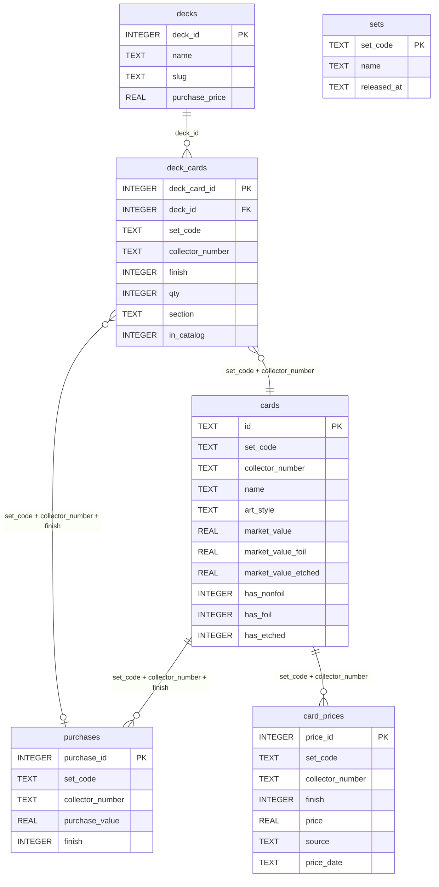

# MTG - Collection tracker

GitHub: [JanAelbr/MTG---Collection-Tracker](https://github.com/JanAelbr/MTG---Collection-Tracker)

A Python + Vue workflow to track a **Magic: The Gathering** collection — singles by set, commander decks, market value, and profit/loss.

The application:

- stores everything in a **SQLite** database (`collection.db`)
- syncs card catalogs via the Scryfall API and EUR prices via Cardmarket
- tracks sets in **`tracked_sets`**; add/remove sets from the Set Manager UI
- tracks commander deck contents and ownership in **`decks`** / **`deck_cards`** / **`purchases`**
- stores card **colors**, **type line**, and **primary card type** for filtering
- calculates market value and profit/loss per card, art style, and deck
- serves an interactive **Vue + FastAPI** web app (Collection, stats, storage, decks, card detail)
- exports and imports portable **backup ZIP** files from Settings

**Upgrading from an older CSV-based workflow:** export a backup from the current app before upgrading, then restore it on the new version. There is no CSV import path in current releases.

---

## Project structure

```text
lotr/
│
├── data/
│   ├── art_styles/                # art-style mapping per set ({set}.json)
│   └── cardmarket_price_guide.json   # Cardmarket guide cache (downloaded locally)
├── docs/
│   ├── decks.md                   # deck model and backup workflow
│   ├── frontend.md                # Vue app, PWA, navigation, filters
│   └── python-guidelines.md
├── logs/                          # generated price logs (not in git)
├── server-frontend/               # Vue 3 interactive app (Vite)
├── server-backend/
│   ├── api/                       # FastAPI routers + services
│   ├── collection/                # shared Python (lib, report, util)
│   └── run_api.py
├── scripts/                       # thin CLI entrypoints (db, prices, launchers)
│   ├── reset_and_build.py             # DB reset + price fetch
│   ├── update_prices.py               # Scryfall catalog gaps + Cardmarket prices
│   ├── db/create_db.py
│   ├── run_app.ps1                    # build frontend + serve app on :8000
│   ├── dev_app.ps1                    # dev: API + Vite on :5173
│   ├── build_frontend.ps1
│   ├── run_daily_update.ps1
│   └── register_daily_task.ps1
└── tests/
```

See **[docs/decks.md](docs/decks.md)** for the deck data model and backup workflow.  
See **[docs/frontend.md](docs/frontend.md)** for the Vue app, PWA, navigation, and UI filters.

---

## Requirements

- Python 3.10+
- **Node.js 22 LTS** (for building the frontend; see [docs/frontend.md](docs/frontend.md))
- internet access for Scryfall and Cardmarket requests
- Node.js for building the frontend (see [docs/frontend.md](docs/frontend.md))

### Installation

```bash
python -m venv .venv
.venv\Scripts\activate
pip install -r requirements.txt
```

On macOS/Linux: `source .venv/bin/activate`

---

## Git

The repo tracks **source code** and art-style JSON, not your local database or generated caches.

| Tracked in git | Not tracked in git |
|----------------|-------------------|
| `scripts/`, `server-backend/`, `server-frontend/`, `tests/`, `docs/` | `.venv/` |
| `data/art_styles/*.json` | `collection.db` (in `%LOCALAPPDATA%\MtgCollectionTracker\`) |
| `readme.md`, `requirements.txt` | `logs/`, Cardmarket cache, `data/*.csv` (legacy leftovers) |

After cloning:

```bash
python -m venv .venv
.venv\Scripts\activate
pip install -r requirements.txt
python scripts\reset_and_build.py

# optional: run the interactive app (see Interactive web app below)
.\scripts\dev_app.ps1 -Install
.\scripts\dev_app.ps1
```

Use **Settings → Backup & restore** to move an existing collection to a new install.

---

## Workflow

### Full reset (empty database + prices)

```bash
python scripts/reset_and_build.py
```

Creates a fresh database and runs price sync for any tracked sets/decks (none on first install). Does not open the browser.

### Step by step

**1. Create database**

```bash
python scripts/db/create_db.py
```

**2. Start the app and add sets**

Open the web app, use **Set Manager** to register sets (imports Scryfall catalog), mark ownership, and create decks in **Decks**.

**3. Update prices (catalog + EUR values)**

```bash
python scripts/update_prices.py
```

Downloads the Cardmarket price guide and updates EUR values. Scryfall is called once per set when that set is first tracked. See [Cardmarket prices](#cardmarket-prices) for flags.

**Typical refresh after ownership changes:**

```bash
python scripts/update_prices.py
```

Or use **Settings → Sync prices** in the app (Cardmarket only).

### Daily update

Prices only (updates the database used by the interactive web app):

```bash
python scripts/update_prices.py
```

On Windows:

```powershell
.\scripts\run_daily_update.ps1
```

Scheduled task (daily at 08:00):

```powershell
.\scripts\register_daily_task.ps1
```

### Interactive web app

The **Vue + FastAPI** app is the primary way to browse and manage the collection.

**Development** (hot reload — API on `:8000`, Vite on `:5173`):

```powershell
.\scripts\dev_app.ps1 -Install   # first time only
.\scripts\dev_app.ps1
```

Open http://localhost:5173

**Production-style** (built frontend served by the API on port 8000):

```powershell
.\scripts\run_app.ps1
```

Open http://localhost:8000

**Frontend only** (after `npm install` in `server-frontend/`):

```powershell
.\scripts\build_frontend.ps1
```

The app is a **PWA** (installable; icons in `server-frontend/public/`). Regenerate icons with `npm run generate-pwa-icons` after changing `app-logo.svg`. See [docs/frontend.md](docs/frontend.md).

**API docs (Swagger UI):** browse and try endpoints at http://localhost:8000/docs (or http://localhost:5173/docs during dev). ReDoc is at `/redoc`; the OpenAPI schema is at `/openapi.json`.

The SQLite database lives in `%LOCALAPPDATA%\MtgCollectionTracker\collection.db` (Windows), or `~/MtgCollectionTracker/collection.db` elsewhere.

#### Navigation

| Section | Default route | Sub-navigation |
|---------|---------------|----------------|
| **Collection** | `/collection/all` | All cards, Top owned, Search, Stats |
| **Storage** | `/storage` | — |
| **Set Manager** | `/manager` | — |
| **Decks** | `/decks` | — |
| **Settings** | `/settings` | — |

`/`, `/collection`, and old `/reports/*` URLs redirect to `/collection/all` or the matching collection view.

The top bar and collection subnav stay fixed while scrolling.

#### Settings (`/settings`)

- **Backup & restore** — export/import `.mtgbackup.zip` (purchases, decks, storage, settings). **Export before upgrading** the app.
- **Set picker mode** — horizontal set browser or dropdown list
- **Price sync** — apply Cardmarket prices only (fast; typically a few seconds). Does not re-run the full Scryfall catalog pipeline.
- **Price strategy** — which EUR field to use (applies everywhere: Collection, Stats, Storage, Decks, card detail)
- **Compare date** — global baseline for price change columns and card detail charts

When prices are older than today, Collection also shows a **Sync prices** banner until you sync or prices catch up.

Use the CLI for a full catalog refresh (new sets, images, metadata backfill):

```bash
python scripts/update_prices.py --refresh-metadata
```

#### Set favourites

In **Set Manager**, star a set to favourite it. Favourited sets sort first in all set dropdowns and show a ★ prefix in the label.

---

## Collection

**Primary UI:** use the interactive web app (`scripts/run_app.ps1` or `scripts/dev_app.ps1`).

**App routes:**

| View | Route |
|------|-------|
| **Collection — all cards** | `/` or `/collection/all` |
| **Collection — top owned** | `/collection/top` |
| **Collection — search** | `/collection/search` |
| **Collection stats** | `/stats` |
| **Storage** | `/storage` |
| **Set Manager** | `/manager` |
| **Decks** | `/decks` |
| **Card detail** | `/card/:setCode/:collectorNumber` |
| **Settings** | `/settings` |

Default landing page: **`/collection/all`**. Old `/reports/*` and `/collection/risers|fallers` URLs redirect to `/collection/all`.

### Filters and behaviour

- **Filter sidebar** on Collection, Search, Manager, and Stats (collapsible; width toggle on wide screens)
- **Set filter** — URL query (`?set=LTR`); full set name in sidebar when using set browser; favourited sets sort first with ★
- **Art style** — per-set list filter; edit link (✎) on All cards opens Set Manager art-style rules
- **All cards** — ownership, finish, type, colour, and sort filters; paginated gallery with zoom control
- **Price change** sort columns use the **compare date** from Settings
- Collection filter changes are cached in memory on the server for fast repeat loads (~50 ms after warm-up)

### Set completion

Owned/catalog counts per set use **distinct base collector numbers**. Serialized prints (collector number ending in `Z`) are excluded. `014` and `14` count as one slot. See `server-backend/collection/util/set_completion.py` and [docs/frontend.md](docs/frontend.md).

### Set Manager

- One set at a time; checkboxes for non-foil / foil / etched where the print exists
- **Art style rules** — define collector-number groups for filters and stats
- **Favourite** sets (★) to pin them to the top of set lists
- Register new sets and import their Scryfall catalog from the UI

### Card detail

- Per-copy ownership (quantity, finish, purchase price, storage location) when multiple copies exist
- Variant gallery (alternate printings) and prev/next navigation within the set
- Foil/non-foil/etched prices, change vs compare date, purchase and profit/loss
- Price chart and history table per finish
- Uses global **price strategy** and **compare date** from Settings

### Card metadata (API)

Each card in the API includes metadata from Scryfall (when the set has been synced):

| API field | Example | Use |
|-----------|---------|-----|
| `colors` | `["W","U"]` | Mana colour (empty for colourless) |
| `typeLine` | `Legendary Creature — Human Wizard` | Full type line |
| `cardType` | `creature` | Primary category for filters (land, instant, sorcery, …) |
| `cardTypes` | `["artifact","creature"]` | All types when a card has multiple |

Available on Collection, Set Manager, Storage, Decks, and card detail responses.

### Decks

- **Browse decks** — deck list with Detail / Overview toggle; per-deck hero gallery and card list with **Images / Table** toggle
- **Deck stats** — aggregate or single-deck metrics, portfolio history chart, card table
- **Owned** on a deck card requires a matching `purchases` row (mark ownership in Set Manager or Storage)
- Deck purchase price is stored on the deck row for invested / ROI figures

---

## Tests

```bash
python -m unittest discover -s tests -v
```

Covers tracked sets, deck helpers, Cardmarket backfill, price history, art styles, set catalog sync, card metadata, reports API, manager favourites, set ordering, set completion, set code aliases, collection backup, and per-copy ownership APIs.

---

## Cardmarket prices

Daily price updates use the **Cardmarket price guide** (one JSON download per run, cached for 24 hours) as the sole EUR source. The parsed guide is also cached as `data/cardmarket_price_guide.pkl` for faster reloads. Scryfall is queried at most once per set, when that set is first added to the local catalog or when metadata is missing.

| Step | Source | When |
|------|--------|------|
| Catalog sync | Scryfall | Once per tracked set, when first added via Set Manager |
| Metadata backfill | Scryfall | When `colors`, `type_line`, or `card_type` are missing for cards in a tracked set |
| Set metadata | Scryfall | Once per set, when the set row is not yet in `collection.db` |
| Price sync | Cardmarket price guide | Every run: owned cards; unowned only in qualifying sets |

Unowned prices in other sets are cleared and no longer updated.

The **Settings → Sync prices** button in the web app runs **Cardmarket only** (no Scryfall, set metadata, or history restore). Bulk card updates use temp-table SQL for speed (typically 1–2 seconds for a full collection after the guide is cached).

```bash
# Normal update: Cardmarket prices + Scryfall for sets not yet in the database
python scripts/update_prices.py

# Cardmarket only — no Scryfall requests
python scripts/update_prices.py --no-scryfall

# Re-fetch Scryfall catalog (colors, type line, card type) for all tracked sets
python scripts/update_prices.py --refresh-metadata

# Re-download today's Cardmarket guide
python scripts/update_prices.py --force-cardmarket
```

Scryfall provides card names, images, finish flags, Cardmarket product URLs, colors, and type information when a set is synced. Cards without a Cardmarket match keep their last known price or stay empty until one is found.

Logs: `logs/cardmarket_prices_{date}.csv` (prices) and `logs/prices_{set}_{date}.csv` (catalog fetch audit only; not imported as prices).

---

## Data model

Database: `%LOCALAPPDATA%\MtgCollectionTracker\collection.db` on Windows, or `~/MtgCollectionTracker/collection.db` elsewhere (SQLite)



### Key constraints

- `purchases`: unique on `(set_code, collector_number, finish)`
- `deck_cards`: unique on `(deck_id, set_code, collector_number, finish, section)` — one row per printing, not per card name
- `card_prices`: unique on `(set_code, collector_number, finish, source, price_date)` — **owned finishes only**, at most **two snapshot dates** (latest sync + previous compare baseline)

### Finish values

| `finish` | Meaning |
|----------|---------|
| `0` | Non-foil |
| `1` | Foil (includes surge/rainbow/galaxy promo foils) |
| `2` | Etched |

Deck CSVs accept an optional `finish` column (`nonfoil`, `foil`, `etched`). Legacy `foil` (`0`/`1`) still works in old files; the app no longer imports deck CSVs.

### `cards`

Card catalog from Scryfall for tracked sets.

| Field | Description |
|-------|-------------|
| `id` | `{SET}-{collector_number}` |
| `set_code` | Set code (LTR, LTC, C13, …) |
| `collector_number` | Collector number |
| `name` | Card name |
| `art_style` | Derived art style label |
| `market_value` | EUR non-foil |
| `market_value_foil` | EUR foil |
| `market_value_etched` | EUR etched |
| `has_nonfoil` / `has_foil` / `has_etched` | Available finishes from Scryfall |
| `image_uri` | Scryfall image URL |
| `cardmarket_url` | Cardmarket product link |
| `colors` | JSON array of WUBRG colours, e.g. `["W","U"]` |
| `type_line` | Full Scryfall type line |
| `card_type` | Primary type for filtering: `creature`, `land`, `instant`, `sorcery`, `artifact`, `enchantment`, `planeswalker`, `battle`, … |

If `type_line` is present but `card_type` is empty, it is derived automatically on startup.

### `purchases`

Owned finishes. Updated when you change ownership in Set Manager or Storage.

### `tracked_sets`

Set codes registered in Set Manager (replaces legacy `data/{set}.csv` tracking).

### `decks` / `deck_cards`

Commander deck definitions. See [docs/decks.md](docs/decks.md).

---

## Art style mapping

Art-style labels come from `data/art_styles/{set_code}.json`. When a set has no rules file yet, one is created automatically with a single `"All"` group for every card. Custom files use collector-number ranges, prefixes, or suffixes to split cards into display groups (e.g. LTR main set vs showcase). Edit rules in **Set Manager** or via the art-style link on the All cards filter.

Set code **PLIST** is treated as an alias for **PLST** in the database and UI.

---

## Data sources

- **Scryfall API** — card data, images, set metadata, colors, and types
- **Cardmarket price guide** — daily JSON export for EUR prices (`downloads.s3.cardmarket.com`)

---

## Python conventions

See **[docs/python-guidelines.md](docs/python-guidelines.md)** for layout, imports, database access, and review checklist.  
See **[docs/frontend.md](docs/frontend.md)** for the Vue app and PWA.
