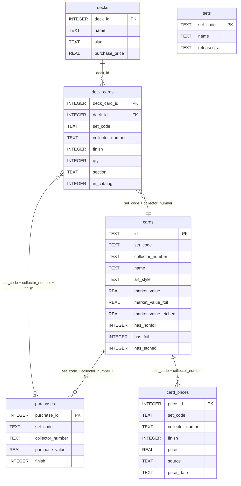

# MTG - Collection tracker

GitHub: [JanAelbr/MTG---Collection-Tracker](https://github.com/JanAelbr/MTG---Collection-Tracker)

A Python workflow to import, track, and report on a **Magic: The Gathering** collection — singles by set, commander precon decks, market value, and profit/loss.

The application:

- builds a SQLite database
- syncs card data via the Scryfall API (sets from purchase CSVs **and** deck lists) and EUR prices via Cardmarket
- imports purchase data from per-set CSV files and commander deck lists
- tracks precon deck contents by exact printing (`set_code` + collector number)
- stores card **colors**, **type line**, and **primary card type** (creature, land, instant, …) for filtering in the UI
- calculates current market value and profit/loss per card, art style, and deck
- serves an interactive **Vue + FastAPI** web app (Collection, stats, storage, decks, card detail)
- optionally generates static HTML reports with navigation, statistics, deck views, and Cardmarket price backfill

Example set codes in use: **LTR**, **LTC**, **CLB**, **NCC**, **C13**, **C17**, **40K**, **PIP**, and others referenced in `data/` or `data/decks/`.

---

## Project structure

```text
lotr/
│
├── data/
│   ├── example.csv                # sample purchase CSV (tracked in git)
│   ├── ltr.csv, ltc.csv, …        # per-set purchases (local, not in git)
│   ├── art_styles/                # art-style mapping per set ({set}.json)
│   ├── cardmarket_price_guide.json   # Cardmarket guide cache (downloaded locally)
│   ├── cardmarket_price_guide.pkl    # parsed guide index (auto-generated)
│   └── decks/
│       ├── decks.csv              # deck manifest (name, price, csv file)
│       ├── *.csv                  # one card list per deck
│       └── sources/               # wiki exports for precon builders
├── docs/
│   ├── decks.md                   # deck CSV format and workflows
│   └── python-guidelines.md
├── logs/                          # generated price logs (not in git)
├── server-frontend/               # Vue 3 interactive app (Vite)
├── server-backend/                  # FastAPI app (api/ + run_api.py)
├── reports/                       # legacy generated HTML (optional)
├── scripts/                       # batch workflows and shared Python libraries
│   ├── reset_and_build.py             # full pipeline (DB + collection + prices + reports)
│   ├── sync_collection.py             # import deck lists + purchases from CSV
│   ├── purchase_import.py             # import purchases + deck ownership only
│   ├── deck_import.py                 # import deck lists only
│   ├── deck_sync.py                   # import one deck list
│   ├── update_prices.py               # Scryfall catalog gaps + Cardmarket prices
│   ├── update_prices_report.py        # prices + reports (no CSV import)
│   ├── generate_report.py             # HTML reports from database only
│   ├── build_catalog_decks.py         # build precon CSVs from wiki + Scryfall
│   ├── build_deck_csv.py              # build LOTR / precon CSVs from definitions
│   ├── generate_precon_decklists.py   # regenerate deck definition module
│   ├── run_app.ps1                    # build frontend + serve app on :8000
│   ├── dev_app.ps1                    # dev: API + Vite on :5173
│   ├── build_frontend.ps1             # npm run build
│   ├── run_daily_update.ps1           # daily price update (Windows)
│   ├── register_daily_task.ps1        # register scheduled task (Windows)
│   ├── db/create_db.py
│   ├── lib/                           # config, import, deck CSV, Scryfall helpers
│   ├── report/                        # report generation modules
│   └── util/                          # Cardmarket, card metadata, migrations, formatting
├── tests/
└── templates/                       # report HTML/CSS/JS sources
```

See **[docs/decks.md](docs/decks.md)** for deck CSV format, ownership, and precon build scripts.

---

## Requirements

- Python 3.10+
- internet access for Scryfall and Cardmarket requests
- per-set purchase files in `data/{set_code}.csv` (copy from `data/example.csv`)
- optional: deck lists in `data/decks/` (manifest + per-deck CSVs)

### Installation

```bash
python -m venv .venv
.venv\Scripts\activate
pip install -r requirements.txt
```

On macOS/Linux: `source .venv/bin/activate`

---

## Git

The repo tracks **source code** and deck definitions, not local purchase data or generated output.

| Tracked in git | Not tracked in git |
|----------------|-------------------|
| `scripts/`, `server-backend/`, `server-frontend/`, `templates/`, `tests/`, `docs/` | `.venv/` |
| `data/art_styles/*.json`, `data/example.csv` | `data/*.csv` (purchase files in `data/`) |
| `data/decks/` (manifest + deck CSVs) | `collection.db` |
| `readme.md`, `requirements.txt` | `reports/`, `logs/`, Cardmarket cache |

After cloning:

```bash
python -m venv .venv
.venv\Scripts\activate
pip install -r requirements.txt
copy data\example.csv data\ltr.csv
python scripts\reset_and_build.py

# optional: run the interactive app (see Interactive web app below)
.\scripts\dev_app.ps1 -Install
.\scripts\dev_app.ps1
```

---

## Workflow

### Full reset (database + import + prices + reports)

```bash
python scripts/reset_and_build.py
```

Creates the database, imports purchases (set CSVs + decks), syncs prices, and generates reports. Does not open the browser.

### Step by step

The pipeline has three independent stages: **collection** (CSV → DB), **prices** (API → DB), **reports** (DB → HTML).

**1. Create database**

```bash
python scripts/db/create_db.py
```

**2. Sync collection (purchases + deck lists)**

```bash
python scripts/sync_collection.py
```

Imports all deck CSVs into `deck_cards`, then rebuilds `purchases` from `data/{set}.csv` files and registered decks. Equivalent to running `deck_import.py` then `purchase_import.py`.

Per-set purchase CSV (`;` delimiter) — save as `data/ltr.csv`, `data/ltc.csv`, etc. Deck ownership comes from `data/decks/`. See [docs/decks.md](docs/decks.md).

**3. Update prices (catalog + EUR values)**

```bash
python scripts/update_prices.py
```

Downloads the Cardmarket price guide once and updates EUR values for owned cards, plus unowned catalog cards only in sets where you own enough cards to qualify. Scryfall is called only once per set, the first time that set is needed and not yet stored in the local catalog. Sets missing color/type metadata are re-synced automatically. See [Cardmarket prices](#cardmarket-prices) for flags.

**4. Generate reports (HTML from database only)**

```bash
python scripts/generate_report.py
```

Options:

| Flag | Effect |
|------|--------|
| `--no-browser` | Do not open `reports/index.html` |
| `--reports top,decks` | Build only selected reports (default: all) |
| `--force-assets` | Recopy shared JS/CSS from templates |

**Typical refresh after CSV changes:**

```bash
python scripts/sync_collection.py
python scripts/update_prices.py
python scripts/generate_report.py --no-browser
```

### Daily update

Prices only (updates the database used by the interactive web app; does **not** rebuild legacy HTML unless requested):

```bash
python scripts/update_prices_report.py
```

Legacy HTML in `reports/` (stats, decks, etc.) when still needed:

```bash
python scripts/update_prices_report.py --static-reports
```

On Windows:

```powershell
.\scripts\run_daily_update.ps1
```

Scheduled task (daily at 08:00):

```powershell
.\scripts\register_daily_task.ps1
```

### Interactive web app

The **Vue + FastAPI** app is the primary way to browse and manage the collection. It replaces the old per-page HTML reports for day-to-day use.

**Development** (hot reload — API on `:8000`, Vite on `:5173`):

```powershell
.\scripts\dev_app.ps1 -Install   # first time only
.\scripts\dev_app.ps1
```

Open http://localhost:5173

**Production-style** (built frontend served by the API on port 8000):

```powershell
.\scripts\run_app.ps1
```

Open http://localhost:8000

**API docs (Swagger UI):** browse and try endpoints at http://localhost:8000/docs (or http://localhost:5173/docs during dev). ReDoc is at `/redoc`; the OpenAPI schema is at `/openapi.json`.

If legacy static reports exist, they are also served at http://localhost:8000/legacy/index.html

The SQLite database lives in `%LOCALAPPDATA%\MtgCollectionTracker\collection.db` (Windows), or `~/MtgCollectionTracker/collection.db` elsewhere.

#### Sidebar navigation

| Section | Default route | Sub-navigation |
|---------|---------------|----------------|
| **Collection** | `/collection/top` | Top owned, Risers, Fallers (animated subnav) |
| **Stats** | `/stats` | — |
| **Storage** | `/storage` | — |
| **Set Manager** | `/manager` | — |
| **Decks** | `/decks/browse` | Browse decks, Deck stats (animated subnav) |
| **Settings** | `/settings` | — |

`/`, `/collection`, and `/decks` redirect to the defaults above. Old `/reports/*` URLs redirect to `/collection/*`.

#### Settings (`/settings`)

- **Price sync** — apply Cardmarket prices only (fast; typically a few seconds). Does not re-run the full Scryfall catalog pipeline.
- **Price strategy** — which EUR field to use (applies everywhere: Collection, Stats, Storage, Decks, card detail)
- **Compare date** — global baseline for risers/fallers and card price change (replaces per-page compare controls)

When prices are older than today, Collection also shows a **Sync prices** banner until you sync or prices catch up.

Use the CLI for a full catalog refresh (new sets, images, metadata backfill):

```bash
python scripts/update_prices.py --refresh-metadata
```

#### Set favourites

In **Set Manager**, star a set to favourite it. Favourited sets sort first in all set dropdowns and show a ★ prefix in the label.

---

## Collection

**Primary UI:** use the interactive web app (`scripts/run_app.ps1` or `scripts/dev_app.ps1`).

Legacy static HTML in `reports/` is optional. The daily price job no longer rebuilds most pages; use `update_prices_report.py --static-reports` when you still need the legacy index or archived HTML copies.

**App routes:**

| View | Route | Legacy file |
|------|-------|-------------|
| **Collection — top owned** | `/` or `/collection/top` | `collection_top.html` |
| **Collection — risers** | `/collection/risers` | `collection_risers.html` |
| **Collection — fallers** | `/collection/fallers` | `collection_fallers.html` |
| **Collection stats** | `/stats` | `collection_stats.html` |
| **Storage** | `/storage` | `collection_storage.html` |
| **Set Manager** | `/manager` | `collection_manager.html` |
| **Decks — browse** | `/decks` or `/decks/browse` | `collection_decks.html` |
| **Decks — stats** | `/decks/stats` | `collection_deck_stats.html` |
| **Card detail** | `/card/:setCode/:collectorNumber` | `card.html?set=…&number=…` |
| **Settings** | `/settings` | — |

Default landing page in the app: **`/collection/top`**. Old `/reports/*` URLs redirect to `/collection/*`.

### Filters and behaviour

- **Set filter** on Collection and Stats — URL query (`?set=LTR`); favourited sets sort first with ★ in the dropdown
- **Risers / fallers** use the **compare date** from Settings (not a per-page control)
- Change columns show euro and percentage (e.g. `+€12.00 (+4.2%)`)
- Collection filter changes are cached in memory on the server for fast repeat loads (~50 ms after warm-up)

### Set Manager

- One set at a time; checkboxes for non-foil / foil where the print exists
- **Favourite** sets (★) to pin them to the top of set lists
- Export purchases to `data/{set}.csv`, then run `python scripts/purchase_import.py`

### Decks

- **Browse decks** — deck list with Detail / Overview toggle; per-deck hero gallery and card list with **Images / Table** toggle
- **Deck stats** — aggregate or single-deck metrics, portfolio history chart, card table
- **Owned** on a deck card requires a matching `purchases` row (run `purchase_import.py`)
- Deck purchase price from `decks.csv` is split across cards for invested / ROI figures

### Card detail

- Variant gallery (alternate printings) and prev/next navigation within the set
- Foil/non-foil prices, change vs compare date, purchase and profit/loss
- Price chart and history table per finish
- Uses global **price strategy** and **compare date** from Settings

### Card metadata (API)

Each card in the API includes metadata from Scryfall (when the set has been synced):

| API field | Example | Use |
|-----------|---------|-----|
| `colors` | `["W","U"]` | Mana colour (empty for colourless) |
| `typeLine` | `Legendary Creature — Human Wizard` | Full type line |
| `cardType` | `creature` | Primary category for filters (land, instant, sorcery, …) |
| `cardTypes` | `["artifact","creature"]` | All types when a card has multiple |

Available on Collection, Set Manager, Storage, Decks, and card detail responses. UI filters by type/colour can be built on top of these fields.

---

## Tests

```bash
python -m unittest discover -s tests -v
```

Covers purchase import, deck import, deck purchase allocation, Cardmarket backfill, price history, art styles, set catalog sync, card metadata, reports API, manager favourites, and set ordering.

---

## Cardmarket prices

Daily price updates use the **Cardmarket price guide** (one JSON download per run, cached for 24 hours) as the sole EUR source. The parsed guide is also cached as `data/cardmarket_price_guide.pkl` for faster reloads. Scryfall is queried at most once per set, when that set is first added to the local catalog or when metadata is missing.

| Step | Source | When |
|------|--------|------|
| Catalog sync | Scryfall | Once per set, the first time it appears in purchases or deck lists |
| Metadata backfill | Scryfall | When `colors`, `type_line`, or `card_type` are missing for cards in a tracked set |
| Set metadata | Scryfall | Once per set, when the set row is not yet in `collection.db` |
| Price sync | Cardmarket price guide | Every run: always for owned cards; for unowned cards only in sets where owned count ≥ min(25, 25% of set size) |

Unowned prices in other sets are cleared and no longer updated.

The **Settings → Sync prices** button in the web app runs **Cardmarket only** (no Scryfall, set metadata, or history restore). Bulk card updates use temp-table SQL for speed (typically 1–2 seconds for a full collection after the guide is cached).

```bash
# Normal update: Cardmarket prices + Scryfall for sets not yet in the database
python scripts/update_prices.py

# Cardmarket only — no Scryfall requests
python scripts/update_prices.py --no-scryfall

# Re-fetch Scryfall catalog (colors, type line, card type) for all tracked sets
python scripts/update_prices.py --refresh-metadata

# Re-download today's Cardmarket guide
python scripts/update_prices.py --force-cardmarket
```

Scryfall provides card names, images, finish flags, Cardmarket product URLs, colors, and type information when a set is synced. Cards without a Cardmarket match keep their last known price or stay empty until one is found.

Logs: `logs/cardmarket_prices_{date}.csv` (prices) and `logs/prices_{set}_{date}.csv` (catalog fetch audit only; not imported as prices).

Use `python scripts/update_prices_report.py` for price update + report generation in one step.

---

## Data model

Database: `%LOCALAPPDATA%\MtgCollectionTracker\collection.db` on Windows, or `~/MtgCollectionTracker/collection.db` elsewhere (SQLite; migrated automatically from the old repo-root file)



### Key constraints

- `purchases`: unique on `(set_code, collector_number, finish)`
- `deck_cards`: unique on `(deck_id, set_code, collector_number, finish, section)` — one row per printing, not per card name
- `card_prices`: unique on `(set_code, collector_number, finish, source, price_date)` — **owned finishes only**, at most **two snapshot dates** (latest sync + previous compare baseline)

### Finish values

| `finish` | Meaning |
|----------|---------|
| `0` | Non-foil |
| `1` | Foil (includes surge/rainbow/galaxy promo foils) |
| `2` | Etched |

Deck CSVs accept an optional `finish` column (`nonfoil`, `foil`, `etched`). Legacy `foil` (`0`/`1`) still works; etched-only prints are inferred on import.

### `cards`

Card catalog from Scryfall for tracked sets.

| Field | Description |
|-------|-------------|
| `id` | `{SET}-{collector_number}` |
| `set_code` | Set code (LTR, LTC, C13, …) |
| `collector_number` | Collector number |
| `name` | Card name |
| `art_style` | Derived art style label |
| `market_value` | EUR non-foil |
| `market_value_foil` | EUR foil |
| `market_value_etched` | EUR etched |
| `has_nonfoil` / `has_foil` / `has_etched` | Available finishes from Scryfall |
| `image_uri` | Scryfall image URL |
| `cardmarket_url` | Cardmarket product link |
| `colors` | JSON array of WUBRG colours, e.g. `["W","U"]` |
| `type_line` | Full Scryfall type line |
| `card_type` | Primary type for filtering: `creature`, `land`, `instant`, `sorcery`, `artifact`, `enchantment`, `planeswalker`, `battle`, … |

If `type_line` is present but `card_type` is empty, it is derived automatically on startup.

### `purchases`

Owned finishes. Populated from `data/{set}.csv` and from deck lists via `purchase_import.py`.

### `decks` / `deck_cards`

Commander deck definitions. See [docs/decks.md](docs/decks.md).

---

## Art style mapping

Art-style labels come from `data/art_styles/{set_code}.json`. When a set has no rules file yet, one is created automatically with a single `"All"` group for every card. Custom files use collector-number ranges, prefixes, or suffixes to split cards into display groups (e.g. LTR main set vs showcase).

---

## Data sources

- **Scryfall API** — card data, images, set metadata, colors, and types (once per set)
- **mtg.wiki** — official commander precon deck lists (via `build_catalog_decks.py`)
- **Cardmarket price guide** — daily JSON export for EUR prices (`downloads.s3.cardmarket.com`)

---

## Python conventions

See **[docs/python-guidelines.md](docs/python-guidelines.md)** for layout, imports, database access, and review checklist.
