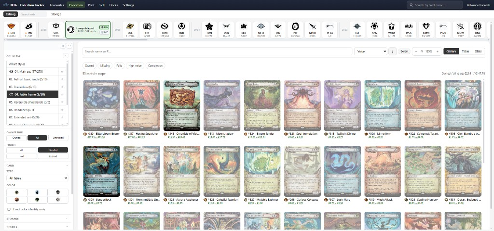
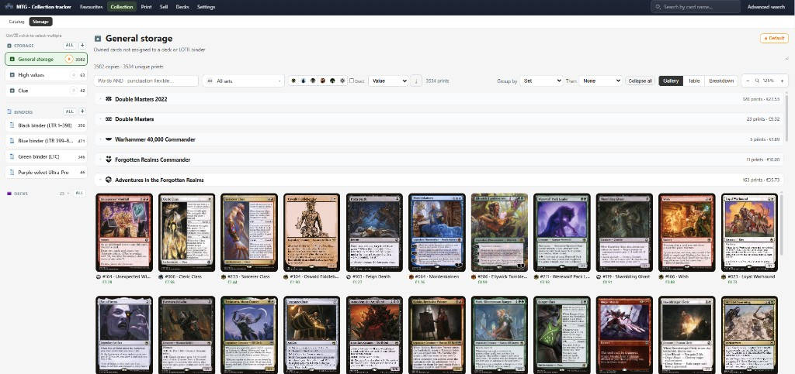
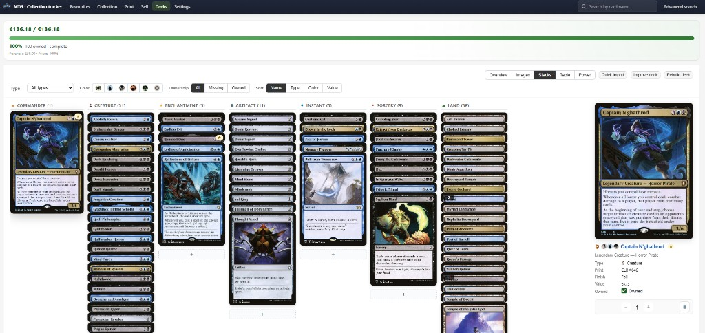
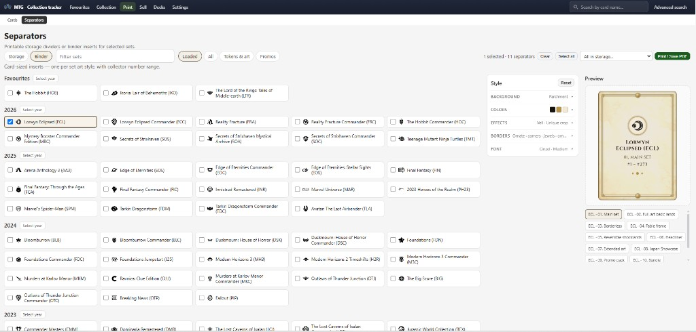
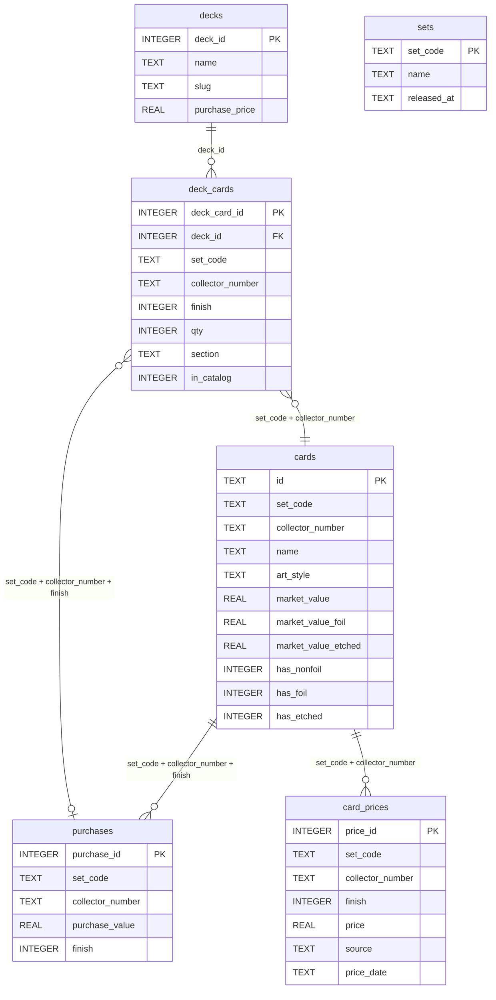

# MTG - Collection tracker

GitHub: [JanAelbr/MTG---Collection-Tracker](https://github.com/JanAelbr/MTG---Collection-Tracker)

A Python + Vue workflow to track a **Magic: The Gathering** collection — singles by set, commander decks, market value, and profit/loss.

The application:

- stores everything in a **SQLite** database (`collection.db`)
- syncs card catalogs via the Scryfall API and EUR prices via Cardmarket
- tracks sets in **`tracked_sets`**; load catalogs from **Settings → Sets** (or right-click refresh in the set browser)
- tracks commander deck contents and ownership in **`decks`** / **`deck_cards`** / **`purchases`**
- stores card **colors**, **type line**, and **primary card type** for filtering
- calculates market value and profit/loss per card, art style, and deck
- serves an interactive **Vue + FastAPI** web app (Collection catalog & storage, print, decks, settings)
- exports and imports portable **backup ZIP** files from Settings

**Upgrading from an older CSV-based workflow:** export a backup from the current app before upgrading, then restore it on the new version. There is no CSV import path in current releases.

## UI examples

**Collection — Catalog** — set browser (favourites, year markers), filters, Gallery / Table / Stats:



**Collection — Storage** — locations and binders, grouped gallery:



**Decks** — commander deck with stacks view and completion:



**Print — Separators** — binder / storage divider printing by set and year:



---

## Project structure

```text
lotr/
│
├── data/
│   └── cardmarket_price_guide.json   # Cardmarket guide cache (downloaded locally)
├── docs/
│   ├── images/                    # UI screenshots for readme
│   ├── decks.md                   # deck model and backup workflow
│   ├── frontend.md                # Vue app, PWA, navigation, filters
│   └── python-guidelines.md
├── server-frontend/               # Vue 3 interactive app (Vite)
├── server-backend/
│   ├── api/                       # FastAPI routers + services
│   ├── collection/                # shared Python (lib, report, util)
│   └── run_api.py
├── scripts/                       # app launchers and frontend build helpers
│   ├── run_app.ps1                    # build frontend + serve app on :8000
│   ├── dev_app.ps1                    # dev: API + Vite on :5173
│   ├── build_frontend.ps1             # build + publish to runtime/
│   ├── publish_runtime.ps1            # copy existing dist → runtime/frontend
│   ├── start_lan_runtime.ps1          # LAN HTTPS service on :8080
│   ├── install_lan_task.ps1           # auto-start at logon (task or Startup folder)
│   └── uninstall_lan_task.ps1
├── runtime/                       # ignored: published frontend, TLS, logs
└── tests/
```

See **[docs/decks.md](docs/decks.md)** for the deck data model and backup workflow.  
See **[docs/frontend.md](docs/frontend.md)** for the Vue app, PWA, navigation, and UI filters.

---

## Requirements

- Python 3.10+
- **Node.js 22 LTS** (for building the frontend; see [docs/frontend.md](docs/frontend.md))
- internet access for Scryfall and Cardmarket requests

### Installation

```bash
python -m venv .venv
.venv\Scripts\activate
pip install -r requirements.txt
```

On macOS/Linux: `source .venv/bin/activate`

---

## Git

The repo tracks **source code**, not your local database or generated caches.

| Tracked in git | Not tracked in git |
|----------------|-------------------|
| `scripts/`, `server-backend/`, `server-frontend/`, `tests/`, `docs/` | `.venv/` |
| `readme.md`, `requirements.txt` | `collection.db` (in `%LOCALAPPDATA%\MtgCollectionTracker\`) |
| | Cardmarket cache, Scryfall cache |
| | `runtime/` (LAN published frontend, TLS, logs) |

After cloning:

```bash
python -m venv .venv
.venv\Scripts\activate
pip install -r requirements.txt

# optional: run the interactive app (see Interactive web app below)
.\scripts\dev_app.ps1 -Install
.\scripts\dev_app.ps1
```

The database is created automatically on first API start. Use **Settings → Backup & restore** to move an existing collection to a new install.

---

## Workflow

Start the app, load sets from **Settings → Sets** (imports the Scryfall catalog; family siblings refresh together), mark ownership in Catalog or Storage, and use **Settings → Sync** for Cardmarket updates.

### Interactive web app

The **Vue + FastAPI** app is the primary way to browse and manage the collection.

**Development** (hot reload — API on `:8000`, Vite on `:5173`):

```powershell
.\scripts\dev_app.ps1 -Install   # first time only
.\scripts\dev_app.ps1
```

Open http://localhost:5173

**Production-style** (built frontend served by the API on port 8000):

```powershell
.\scripts\run_app.ps1
```

Open http://localhost:8000

**Frontend only** (after `npm install` in `server-frontend/`):

```powershell
.\scripts\build_frontend.ps1
```

This also publishes the build into `runtime/frontend` for the LAN service (see below).

The app is a **PWA** (installable; icons in `server-frontend/public/`). Regenerate icons with `npm run generate-pwa-icons` after changing `app-logo.svg`. See [docs/frontend.md](docs/frontend.md).

**API docs (Swagger UI):** browse and try endpoints at http://localhost:8000/docs (or http://localhost:5173/docs during dev). ReDoc is at `/redoc`; the OpenAPI schema is at `/openapi.json`.

The SQLite database lives in `%LOCALAPPDATA%\MtgCollectionTracker\collection.db` (Windows), or `~/MtgCollectionTracker/collection.db` elsewhere.

#### LAN runtime (startup service)

Always-on HTTPS on port **8080** for other devices on the LAN. Artifacts and logs live in the gitignored `runtime/` folder (`frontend/`, `tls/`, `logs/service.log`). Dev on `:8000` / `:5173` is unchanged.

Auto-start runs **at your Windows logon**. `install_lan_task.ps1` tries Task Scheduler first; if that is blocked (common without elevation), it installs a launcher in your user **Startup** folder instead.

One-time setup (frontend must already be built, or run `build_frontend.ps1` first):

```powershell
.\scripts\publish_runtime.ps1
.\scripts\install_lan_task.ps1
.\scripts\start_lan_runtime.ps1   # start immediately without re-logon
```

After frontend changes, rebuild (publishes automatically) or publish only, then restart the process (or re-logon):

```powershell
.\scripts\build_frontend.ps1
# stop the old process if needed, then:
.\scripts\start_lan_runtime.ps1
```

Open `https://127.0.0.1:8080` or `https://<lan-ip>:8080` and accept the self-signed certificate once. Allow Windows Firewall inbound TCP **8080** if phones/PCs cannot connect. Remove auto-start with `.\scripts\uninstall_lan_task.ps1`.

Optional cleanup: if an old broken **At startup** scheduled task named `MtgCollectionTrackerLan` remains, delete it once from an **elevated** PowerShell: `schtasks /Delete /TN MtgCollectionTrackerLan /F`.

#### Navigation

| Section | Default route | Sub-navigation |
|---------|---------------|----------------|
| **Favourites** | `/` | — |
| **Collection** | `/collection/all` | Catalog · Storage |
| **Print** | `/print` | Cards · Separators |
| **Sell** | `/sell` | — |
| **Decks** | `/decks` | — |
| **Settings** | `/settings/display` | Display · Sets · Stats · Sync · Backup |

`/collection`, old `/stats`, and `/reports/*` URLs redirect into Collection or Settings as appropriate.

The top bar and Collection subnav stay fixed while scrolling.

#### Settings

| Page | Route | Purpose |
|------|-------|---------|
| **Display** | `/settings/display` | Page size, set browser order, tokens & promos in the gallery |
| **Sets** | `/settings/sets` | Load / remove set families, favourites, reload catalogs from Scryfall |
| **Stats** | `/settings/stats` | Portfolio stats across all tracked sets |
| **Sync** | `/settings/sync` | Cardmarket price sync; clear orphan catalogs |
| **Backup** | `/settings/backup` | Export / import `.mtgbackup.zip` |

When prices are older than today, Collection also shows a **Sync prices** banner until you sync or prices catch up.

#### Set browser & favourites

On **Catalog**, the horizontal set gallery:

- Groups **favourite** sets first (divider), then the rest with **year labels** and dividers when the release year changes
- Right-click a set to **favourite / unfavourite** or **refresh** its Scryfall catalog (siblings in the family reload too; a spinner shows while refreshing)
- Shows completion counts on each tile; expand a family to pick subset codes (tokens & promos optional via Settings → Display)

Favourited sets also sort first in set dropdowns elsewhere.

---

## Collection

**Primary UI:** use the interactive web app (`scripts/run_app.ps1` or `scripts/dev_app.ps1`).

**App routes:**

| View | Route |
|------|-------|
| **Favourites** | `/` |
| **Catalog** | `/collection/all` |
| **Catalog — search** | `/collection/search` |
| **Catalog — stats** | `/collection/all?set=CODE&view=stats` |
| **Storage** | `/storage` |
| **Print cards** | `/print/cards` |
| **Separators** | `/print/separators` |
| **Sell** | `/sell` |
| **Decks** | `/decks` |
| **Card detail** | `/card/:setCode/:collectorNumber` |
| **Settings** | `/settings/display` (and nested settings routes) |

Default landing page: **Favourites** (`/`). Catalog is `/collection/all`. Old `/reports/*`, `/manager`, and standalone `/stats` URLs redirect into Catalog or Settings.

### Filters and behaviour

- **Filter sidebar** on Catalog (and Catalog stats); collapsible on wide screens
- **Set browser** — favourites first, year markers for the rest; URL query (`?set=LTR`); family scope with `?family=1`
- **Art style** — per-set list filter; edit link (✎) opens the inline art-style rules editor
- **Catalog views** — **Gallery · Table · Stats** (far right of the toolbar). Gallery has ownership, finish, type, colour, and sort filters with a virtualized card grid. Table (single set only) has per-finish ownership, price health, bulk storage assign, and infinite scroll. Stats shows value tiles, rarity completion, and by-set / by-art-style tables for the selected set (filters apply)
- **Storage** — Gallery · Table · Breakdown; group by set (and nested group-by); locations include general storage, binders, and decks
- **Price change** sort columns compare against the previous price snapshot automatically
- Collection filter changes are cached in memory on the server for fast repeat loads

Old `/manager` URLs redirect to `/collection/all?view=table`.

### Set completion

Owned/catalog counts per set use **distinct base collector numbers**. Serialized prints (collector number ending in `Z`) are excluded. `014` and `14` count as one slot. See `server-backend/collection/util/set_completion.py` and [docs/frontend.md](docs/frontend.md).

### Catalog — table mode

When a specific set is selected on **Catalog**, switch to **Table** view to:

- Toggle non-foil / foil / etched ownership with checkboxes per print
- Filter owned cards with URL/price issues
- Bulk-assign storage to selected owned rows
- Edit **art style rules** inline (collector-number groups for filters and stats)

Reload Scryfall catalogs from the set browser context menu or **Settings → Sets**.

`/manager?set=CODE` redirects to `/collection/all?set=CODE&view=table`.

### Card detail

- Per-copy ownership (quantity, finish, purchase price, storage location) when multiple copies exist
- Variant gallery (alternate printings) and prev/next navigation within the set
- Foil/non-foil/etched prices, change vs previous snapshot, purchase and profit/loss
- Price chart and history table per finish
- Uses global **price strategy** from Settings

### Card metadata (API)

Each card in the API includes metadata from Scryfall (when the set has been synced):

| API field | Example | Use |
|-----------|---------|-----|
| `colors` | `["W","U"]` | Mana colour (empty for colourless) |
| `typeLine` | `Legendary Creature — Human Wizard` | Full type line |
| `cardType` | `creature` | Primary category for filters (land, instant, sorcery, …) |
| `cardTypes` | `["artifact","creature"]` | All types when a card has multiple |

Available on Collection, Storage, Decks, and card detail responses.

### Decks

- **Browse decks** — deck list; open a deck for Overview / Images / Stacks / Table / Power
- **Stacks** — cards grouped by type with expandable rows and a detail pane
- **Owned** on a deck card requires a matching `purchases` row (mark ownership in Catalog table view, Storage, or on the deck)
- Deck purchase price is stored on the deck row for invested / ROI figures
- Swap or add cards from storage via the deck card context actions

---

## Tests

```bash
python -m unittest discover -s tests -v
```

Covers tracked sets, deck helpers, Cardmarket backfill, price history, art styles, set catalog sync, card metadata, reports API, manager favourites, set ordering, set completion, set code aliases, collection backup, and per-copy ownership APIs.

---

## Cardmarket prices

Daily price updates use the **Cardmarket price guide** (one JSON download per run, cached for 24 hours) as the sole EUR source. The parsed guide is also cached as `data/cardmarket_price_guide.pkl` for faster reloads. Scryfall is queried at most once per set, when that set is first added to the local catalog or when metadata is missing.

| Step | Source | When |
|------|--------|------|
| Catalog sync | Scryfall | Once per tracked set, when first loaded from Settings → Sets or the set browser |
| Metadata backfill | Scryfall | When `colors`, `type_line`, or `card_type` are missing for cards in a tracked set |
| Set metadata | Scryfall | Once per set, when the set row is not yet in `collection.db` |
| Price sync | Cardmarket price guide | Every run: owned cards; unowned only in qualifying sets |

Unowned prices in other sets are cleared and no longer updated.

The **Settings → Sync** button in the web app runs **Cardmarket only** (no Scryfall, set metadata, or history restore). Bulk card updates use temp-table SQL for speed (typically 1–2 seconds for a full collection after the guide is cached).

Scryfall provides card names, images, finish flags, Cardmarket product URLs, colors, and type information when a set is loaded from Settings → Sets or refreshed from the set browser. Cards without a Cardmarket match keep their last known price or stay empty until one is found.

---

## Data model

Database: `%LOCALAPPDATA%\MtgCollectionTracker\collection.db` on Windows, or `~/MtgCollectionTracker/collection.db` elsewhere (SQLite)


```mermaid
erDiagram
    cards {
        TEXT id PK
        TEXT set_code
        TEXT collector_number
        TEXT name
        TEXT art_style
        REAL market_value
        REAL market_value_foil
        REAL market_value_etched
        INTEGER has_nonfoil
        INTEGER has_foil
        INTEGER has_etched
    }

    purchases {
        INTEGER purchase_id PK
        TEXT set_code
        TEXT collector_number
        REAL purchase_value
        INTEGER finish
    }

    card_prices {
        INTEGER price_id PK
        TEXT set_code
        TEXT collector_number
        INTEGER finish
        REAL price
        TEXT source
        TEXT price_date
    }

    decks {
        INTEGER deck_id PK
        TEXT name
        TEXT slug
        REAL purchase_price
    }

    deck_cards {
        INTEGER deck_card_id PK
        INTEGER deck_id FK
        TEXT set_code
        TEXT collector_number
        INTEGER finish
        INTEGER qty
        TEXT section
        INTEGER in_catalog
    }

    sets {
        TEXT set_code PK
        TEXT name
        TEXT released_at
    }

    cards ||--o{ purchases : "set_code + collector_number + finish"
    cards ||--o{ card_prices : "set_code + collector_number"
    decks ||--o{ deck_cards : "deck_id"
    deck_cards }o--|| cards : "set_code + collector_number"
    deck_cards }o--o| purchases : "set_code + collector_number + finish"
```

### Key constraints

- `purchases`: unique on `(set_code, collector_number, finish)`
- `deck_cards`: unique on `(deck_id, set_code, collector_number, finish, section)` — one row per printing, not per card name
- `card_prices`: unique on `(set_code, collector_number, finish, source, price_date)` — **owned finishes only**, at most **two snapshot dates** (latest sync + previous compare baseline)

### Finish values

| `finish` | Meaning |
|----------|---------|
| `0` | Non-foil |
| `1` | Foil (includes surge/rainbow/galaxy promo foils) |
| `2` | Etched |

Deck CSVs accept an optional `finish` column (`nonfoil`, `foil`, `etched`). Legacy `foil` (`0`/`1`) still works in old files; the app no longer imports deck CSVs.

### `cards`

Card catalog from Scryfall for tracked sets.

| Field | Description |
|-------|-------------|
| `id` | `{SET}-{collector_number}` |
| `set_code` | Set code (LTR, LTC, C13, …) |
| `collector_number` | Collector number |
| `name` | Card name |
| `art_style` | Derived art style label |
| `market_value` | EUR non-foil |
| `market_value_foil` | EUR foil |
| `market_value_etched` | EUR etched |
| `has_nonfoil` / `has_foil` / `has_etched` | Available finishes from Scryfall |
| `image_uri` | Scryfall image URL |
| `cardmarket_url` | Cardmarket product link |
| `colors` | JSON array of WUBRG colours, e.g. `["W","U"]` |
| `type_line` | Full Scryfall type line |
| `card_type` | Primary type for filtering: `creature`, `land`, `instant`, `sorcery`, `artifact`, `enchantment`, `planeswalker`, `battle`, … |

If `type_line` is present but `card_type` is empty, it is derived automatically on startup.

### `purchases`

Owned finishes. Updated when you change ownership in Catalog or Storage.

### `tracked_sets`

Set codes registered from Settings → Sets (`tracked_sets` table in `collection.db`).

### `decks` / `deck_cards`

Commander deck definitions. See [docs/decks.md](docs/decks.md).

---

## Art style mapping

Art-style labels are stored in the local SQLite database (`art_style_rules` table). On first run, bundled rules for sets with custom collector-number groupings are seeded automatically; other sets default to a single `"All"` group. Rules use collector-number ranges, prefixes, or suffixes to split cards into display groups (e.g. LTR main set vs showcase). Edit rules from **Catalog** (✎ on the art-style filter or table view). Legacy `data/art_styles/*.json` files are imported once on upgrade if present. See **[docs/art-styles.md](docs/art-styles.md)** for the seed generator workflow.

Set code **PLIST** is treated as an alias for **PLST** in the database and UI.

---

## Data sources

- **Scryfall API** — card data, images, set metadata, colors, and types
- **Cardmarket price guide** — daily JSON export for EUR prices (`downloads.s3.cardmarket.com`)

---

## Python conventions

See **[docs/python-guidelines.md](docs/python-guidelines.md)** for layout, imports, database access, and review checklist.  
See **[docs/frontend.md](docs/frontend.md)** for the Vue app and PWA.
